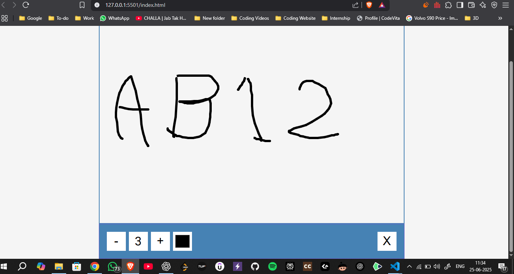

# Drawing App

Welcome to the Drawing App! This application allows users to create and share their digital drawings.

## Features

- **User-friendly Interface**: Easy to navigate and use.
- **Multiple Tools**: Various drawing tools like brush, eraser, and shapes.
- **Color Palette**: Wide range of colors to choose from.
- **Save and Share**: Save your drawings and share them with others.

## Demo



## Installation

1. Clone the repository:
    ```bash
    git clone https://github.com/yourusername/drawing-app.git
    ```

## Usage


1. Install 'Live Server' from VS Code extension or other extension store

2. Restart the VS Code

3. Click on Go Live button at bottom right corner/ or Visit ```http://127.0.0.1:5501/index.html``` on your browser.


## Contributing

Contributions are welcome!

## License

This project is licensed under the MIT License. See the [LICENSE](LICENSE) file for details.

## Contact

For any questions or feedback, please contact amanrajpoot5612@gmail.com(mailto:amanrajpoot5612@gmail.com).
